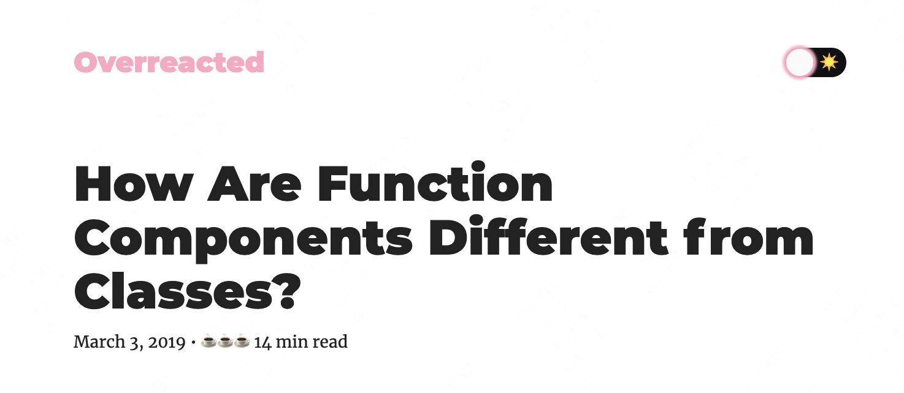

# 《函数组件和类组件有何不同？》



## 前言

本篇是 Dan 神博客[《How Are Function Components Different from Classes?》](https://overreacted.io/how-are-function-components-different-from-classes/)的笔记和读后感。当然，也强烈安利 Dan 神博客的其他文章（指路：[🔗 overreacted.io](https://overreacted.io/)），都很精辟，以后也会多尽量写些博客笔记来加深理解。Shout out to Dan 神 🫡

## 先说结论

> `心智模型（Mental Model）不一样。`

我理解的心智模型差异来源于背后的`编程范式（paradiams）`所致，类组件是`面向对象编程`思想（Object Oriented Programming, `OOP`），而函数式组件是`函数式编程`思想（Functional Programming, `FP`），编程范式不同导致了心智模型的差异。

两种编程范式熟好熟坏，我觉得仁者见仁，智者见智，不是本文重点，咱也不敢说。从 React 推出函数式组件以及 Hooks 的趋势来看，未来 React 的发展方向肯定是继续践行函数式编程。

说到这里，可以插播一条历史故事， 是我在 Vue 作者尤雨溪的一个知乎回答里看到的：“设计出 React 的 Jordan Walker 是个 Ocaml 脑残粉，真相大白了”。Ocaml 是 Caml 编程语言的主要实现，而 Caml 又是基于函数式编程 FP 语言。说明 React 从一开始设计出来就一直在践行函数式编程思想，破案了:)。

> `函数式组件能捕获渲染所用的值。`

编程范式心智模型其实扯的有点远，落到具体表现来讲，有个典型的区别在于：`函数式组件能捕获渲染所用的值`。原文是“`Function components capture the rendered values`”，Dan 认为这是在过去一直存在但容易被忽视的最大区别。

接下来我们就从一个具体的场景示例来解读这句话的含义。

## 场景 Demo

`场景`：实现一个关注提醒组件，点击关注 Follow 按钮，延时 3 秒钟后会弹出显示被关注了的用户的名字（props.user），比如点击关注 Dan 会提示「Followed Dan」。

以下两种组件的实现：

### 函数式组件

```js
function ProfilePage(props) {
  const showMessage = () => {
    alert('Followed ' + props.user);
  };

  const handleClick = () => {
    setTimeout(showMessage, 3000);
  };

  return <button onClick={handleClick}>Follow</button>;
}
```

### 类组件

```js
class ProfilePage extends React.Component {
  showMessage = () => {
    alert('Followed ' + this.props.user);
  };

  handleClick = () => {
    setTimeout(this.showMessage, 3000);
  };

  render() {
    return <button onClick={this.handleClick}>Follow</button>;
  }
}
```

以上两种组件实现方式乍看一样，但实际上却有个坑@\_@。

坑在哪呢？设想这样一个场景，当你在我的主页中关注了我，`props.user` 等于我的名字 `callmeSoon` 毫无疑问，但紧接着你立刻跳到了 Dan 的主页，这时候 `props.user` 其实已经更新成 `Dan` 了，过了 3 秒种后，弹窗会提示你关注了谁呢？

- 函数式组件：`「Followed callmeSoon」`（✅ 符合预期）

- 类组件：`「Followed Dan」`（❌ 不符合预期，你并没有关注 Dan）

更多细节可以在这个[ 🔗CodeSandbox Demo ](https://codesandbox.io/s/pjqnl16lm7?file=/src/index.js)里测试。

## 闭包 closure

上面场景中两种组件之所以会有不同地表现，是因为函数式组件利用`闭包 closure `特性获取到的 `props.user` 不会改变，始终是点击关注时候的用户，而类组件中 `this` 永远是一直变化的，所以 `this.props.user` 始终是当前最新的用户但不一定是 3 秒前点击关注的用户。

更抽象一点，可以说「一个是`immutable不可变的`，一个是`mutable可变的`」。

闭包通常会被避免使用的一个主要原因就是很难去照顾那些会随时间变化的变量，`but` 但是，在 `React` 中 `props` 和 `state` 都是 `immutable` 不可变的，不用担心闭包的这个问题。所以说`闭包`和 React 的 `immutable` 理念其实是一致的。

再扯远点，我觉得 React 的 `immutability` 数据不可变理念也是因为背后函数式编程思想的缘故吧，`immutability` 也正是 `React` 真正与 `Vue` 等其他建立在 `mutability` 基础上框架的最大区别（这一点 Dan 也曾在采访中提过），但这个也无所谓对错，只是道不同，不相...提并论了（doge）。

_说到这里，也就能解释开头的结论了：`「函数式组件能捕获渲染所用的值」`——因为`闭包特性`。_

当然，要在这里说明的是，函数式组件与类组件两种不同表现本事并不是互斥的，我们也可以通过手动闭包捕获的方法在类组件实现类似函数式组件的表现，也可以在函数式组件中通过 useRef 来实时捕获最新的值。

## 类组件中手动闭包捕获 -> 函数式组件

在类组件中可以通过手动闭包捕获的方式来捕获渲染所用的值，达到函数式组件效果。

```js
class ProfilePage extends React.Component {
  showMessage = (user) => {
    alert('Followed ' + user);
  };

  handleClick = () => {
    // 捕获渲染所用的props
    const props = this.props;
    setTimeout(() => this.showMessage(props.user), 3000);
  };

  render() {
    return <button onClick={this.handleClick}>Follow</button>;
  }
}
```

## 函数式组件 useRef -> 类组件

在函数式组件中可以通过 `useRef` 的 Hook 能力来追踪最新的值，达到类组件的效果。可以把 `something.current` 看作 `this.something` 的镜像。

```js
function ProfilePage(props) {
  // 保持追踪最新的值
  const latestUser = useRef('');
  useEffect(() => {
    latestUser.current = props.user;
  });

  const showMessage = () => {
    alert('Followed ' + latestUser.current);
  };

  const handleClick = () => {
    setTimeout(showMessage, 3000);
  };

  return <button onClick={handleClick}>Follow</button>;
}
```

## 总结

上面我们解释了什么是`「函数式组件能捕获渲染所用的值」`，除了`what`还需要思考`why`，为什么 React 要这么设计？其实是 React 背后`immutability`和`函数式编程`的设计理念使然，函数式组件的这个特性能在很多场景中表现符合预期，而且能更方便在`并发模式（Concurrent Mode）`下便编写代码，所以 React 选择了它作为默认行为表现也是合理的。

当然鱼和熊掌不可兼得，函数式组件不能满足所有的应用场景，在需要追踪最新变化值的时候还是需要解决 ref 能力，类组件同理。**但这并不是对方的 bug，而是各自的特性。**

最后，对于我们使用`React`的开发者来说，明白函数式组件和类组件之间的`心智模型差异`能够更好地帮助我们 coding。_在编写函数式组件时有一条很重要的心智规则就是“写代码时要认为任何值都可以随时更改”（原文：The best mental rule I’ve found so far with hooks is ”code as if any value can change at any time”）。_

1. [《how-are-function-components-different-from-classes》- Dan](https://overreacted.io/how-are-function-components-different-from-classes/)
2. [Vue 和 React 的这个行为各是出于什么考虑？ - 黄玄的回答 - 知乎 ](https://www.zhihu.com/question/543057656/answer/2575930077)
3. [React.js 到底是迎合部分人口味还是真的是自然而然产生的？ - 尤雨溪的回答 - 知乎](https://www.zhihu.com/question/35935368/answer/65237347)
